<div align="center">



### `developer.exe` × `artist.exe` × `zoe_main.exe`

<sub>୨୧ Code, creativity, and questionable League decisions ୨୧</sub>

<br><br>

[`github.com/seavens3nt`](https://github.com/seavens3nt)

</div>

---

<div align="center">

## `> about_me.txt`

```text
╭────────────────────────────────────────╮
│ status     : creating something cute   │
│ class      : developer + artist        │
│ alignment  : chaotic pink              │
│ main       : Zoe                       │
│ companion  : Chiikawa                  │
╰────────────────────────────────────────╯
```

**Stinky Zoe main** `(˶ᵔ ᵕ ᵔ˶)`


</div>

---

<div align="center">

## `> tech_stack.exe`

### `⌨ languages`


<details>
<summary><b>♡ open creative_tools.exe</b></summary>

<br>


</details>

<details>
<summary><b>♡ open media_tools.exe</b></summary>

<br>


</details>

</div>

---

<div align="center">

## `> current_status.log`

```text
[████████░░] making art
[██████░░░░] writing code
[██████████] thinking about Chiikawa
[██████████] picking Zoe again
```

</div>

---

<details>
<summary><b>♡ click to release Chiikawa</b></summary>

<br>

<div align="center">


```text
CHIikawa.exe started successfully! ♡
```

</div>

</details>

---

<div align="center">

```text
 /\_/\
( •.• )  < have a cute day!
 / >♡
```

### `SESSION COMPLETE ♡`

<sub>Thanks for visiting my profile!</sub>

<br>

[`@seavens3nt`](https://github.com/seavens3nt)

`⋆｡°✩ press any key to sparkle ✩°｡⋆`

</div>
